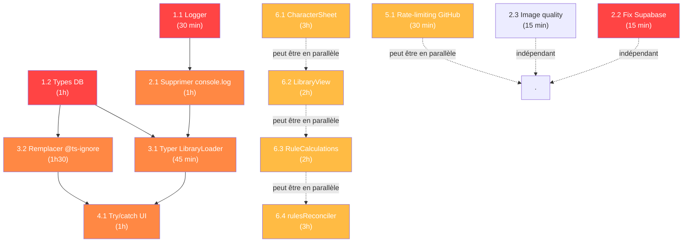

# 📋 Plan de Mise en Place - Point 4 (Issues Hautes)

**Date** : 2026-02-11
**Audit** : AUDIT_2026-02-11_RAW.md
**Version du projet** : 2.37.0

---

## 📌 Vue d'ensemble

### Objectif
Traiter les 7 issues hautes pour améliorer la qualité, la sécurité des types et la maintenabilité de l'application.

### Scope
- 4.1 - 60+ `console.log` en production (17 fichiers)
- 4.2 - 77+ usages de `any` et 27 fichiers avec `@ts-ignore`
- 4.3 - Fichiers trop volumineux (5 fichiers critiques)
- 4.4 - Promesses non gérées dans les composants UI
- 4.5 - Pas de rate-limiting sur le GitHub Service
- 4.6 - Placeholder Supabase masque les erreurs de config
- 4.7 - Qualité d'image trop agressive

### Effort Total Estimé
**18-22 heures**

---

## 🏗️ Phase 1️⃣ - Fondation (2-3h)

### 1.1 Créer un logger conditionnel

**Fichier** : `src/utils/logger.ts` (nouveau)
**Effort** : 30 min
**Priorité** : 🔴 CRITIQUE

#### Objectif
Centraliser la gestion des logs pour pouvoir les désactiver en production tout en gardant les erreurs visibles.

#### Code de référence
```typescript
// src/utils/logger.ts
/**
 * Conditional logger that respects import.meta.env.DEV
 * Logs are suppressed in production builds
 */
export const logger = {
  /**
   * Dev-only log - suppressed in production
   */
  log: (...args: any[]) => {
    if (import.meta.env.DEV) {
      console.log('[APP]', ...args);
    }
  },

  /**
   * Dev-only warning - suppressed in production
   */
  warn: (...args: any[]) => {
    if (import.meta.env.DEV) {
      console.warn('[WARN]', ...args);
    }
  },

  /**
   * Always visible error logging
   */
  error: (...args: any[]) => {
    console.error('[ERROR]', ...args);
  },

  /**
   * Dev-only info - suppressed in production
   */
  info: (...args: any[]) => {
    if (import.meta.env.DEV) {
      console.info('[INFO]', ...args);
    }
  }
};
```

#### Critères de succès
- ✅ Fichier créé et exporte les 4 méthodes (`log`, `warn`, `error`, `info`)
- ✅ Les logs de type info/log/warn sont supprimées en production (`import.meta.env.DEV === false`)
- ✅ Les erreurs restent visibles même en production
- ✅ Prêt à être utilisé par les tâches suivantes

---

### 1.2 Créer types pour les modèles DB

**Fichier** : `src/types/database.ts` (nouveau)
**Effort** : 1h
**Priorité** : 🔴 CRITIQUE

#### Objectif
Remplacer les `<any>` par des types stricts pour le compilateur TypeScript et éviter les `@ts-ignore`.

#### Types à créer

```typescript
// src/types/database.ts

/**
 * Database model for traits (avantages/défauts)
 */
export interface DBTrait {
  id: string;
  setting_id: string | null; // Global if null
  name: string;
  description?: string;
  points?: number;
  category?: string;
  created_at?: string;
  updated_at?: string;
}

/**
 * Database model for skills (compétences)
 */
export interface DBSkill {
  id: string;
  setting_id: string | null;
  name: string;
  description?: string;
  defaultCategory?: string; // Default placement
  created_at?: string;
  updated_at?: string;
}

/**
 * Database model for specializations (spécialisations)
 */
export interface DBSpecialization {
  id: string;
  setting_id: string | null;
  name: string;
  description?: string;
  skillIds?: string[]; // Associated skills
  created_at?: string;
  updated_at?: string;
}

/**
 * Database model for backgrounds (arrières-plans)
 */
export interface DBBackground {
  id: string;
  setting_id: string | null;
  name: string;
  description?: string;
  defaultCategory?: string;
  created_at?: string;
  updated_at?: string;
}

/**
 * Database model for counters (compteurs)
 */
export interface DBCounter {
  id: string;
  setting_id: string | null;
  name: string;
  description?: string;
  maxValue?: number;
  defaultValue?: number;
  xpCost?: number;
  defaultCategory?: string;
  created_at?: string;
  updated_at?: string;
}

/**
 * Database model for game settings/campaigns
 */
export interface DBGameSetting {
  id: string;
  name: string;
  version: string;
  last_updated: string;
  configurations: Record<string, any>; // JSONB
  definitions: Record<string, any>; // JSONB
  is_public: boolean;
  created_at?: string;
  updated_at?: string;
}

/**
 * Relationship: Settings to Traits
 */
export interface RelSettingTrait {
  setting_id: string;
  trait_id: string;
  is_active: boolean;
}

/**
 * Relationship: Settings to Skills
 */
export interface RelSettingSkill {
  setting_id: string;
  skill_id: string;
  default_category: string;
  is_active: boolean;
}

/**
 * Relationship: Settings to Backgrounds
 */
export interface RelSettingBackground {
  setting_id: string;
  background_id: string;
  default_category: string;
  is_active: boolean;
}

/**
 * Relationship: Settings to Counters
 */
export interface RelSettingCounter {
  setting_id: string;
  counter_id: string;
  default_category: string;
  is_active: boolean;
}

/**
 * Relationship: Settings to Specializations
 */
export interface RelSettingSpecialization {
  setting_id: string;
  specialization_id: string;
  is_active: boolean;
}

/**
 * Trait variant names (aliases)
 */
export interface DBTraitVariant {
  id: string;
  setting_id: string | null;
  trait_id: string;
  name: string;
}

/**
 * Skill variant names (aliases)
 */
export interface DBSkillVariant {
  id: string;
  setting_id: string | null;
  skill_id: string;
  name: string;
}

/**
 * Background variant names (aliases)
 */
export interface DBBackgroundVariant {
  id: string;
  setting_id: string | null;
  background_id: string;
  name: string;
}
```

#### Critères de succès
- ✅ Types couvrent tous les modèles mentionnés dans l'audit
- ✅ Chaque type documente les champs principaux avec JSDoc
- ✅ Relations incluses (RelSetting*)
- ✅ Cohérence avec les services (DatabaseService, LibraryLoader)
- ✅ Fichier prêt pour la tâche 3.1 (typage LibraryLoader)

---

## 🚀 Phase 2️⃣ - Correctifs Rapides (1-2h)

### 2.1 Supprimer console.log et utiliser le logger

**Fichiers affectés** : 17 fichiers
**Effort** : 1h
**Priorité** : 🟠 HAUTE
**Dépend de** : 1.1 Logger

#### Fichiers prioritaires
```
1. src/services/CampaignService.ts         (10+ instances)
2. src/services/RulesLoader.ts             (5 instances)
3. src/context/CharacterContext.tsx        (4 instances)
4. src/services/githubService.ts           (4 instances)
5. src/context/RulesContext.tsx            (3 instances)
+ 12 autres fichiers secondaires
```

#### Approche
1. Remplacer tous les `console.log()` par `logger.log()`
2. Remplacer tous les `console.warn()` par `logger.warn()`
3. Remplacer tous les `console.info()` par `logger.info()`
4. Garder les `console.error()` uniquement si nécessaire (sinon ErrorService)
5. **Supprimer le bloc `DEBUG SCHEMA`** complet dans CampaignService.ts (lignes 290-312)

#### Pattern de remplacement

```typescript
// AVANT
console.log("Data loaded:", data);
console.warn("[Migration] Failed...", e);

// APRÈS
import { logger } from '../utils/logger';

logger.log("Data loaded:", data);
logger.warn("[Migration] Failed...", e);
```

#### Critères de succès
- ✅ Zéro `console.log` ou `console.warn` direct dans le code source
- ✅ Tous les `import { logger }` présents aux fichiers modifiés
- ✅ Bloc `DEBUG SCHEMA` complètement supprimé
- ✅ `console.error` remplacés par `ErrorService.handleError()`
- ✅ ESLint ne signale plus de violation

---

### 2.2 Fix Supabase placeholder

**Fichier** : `src/services/supabase.ts`
**Effort** : 15 min
**Priorité** : 🔴 CRITIQUE

#### Problème
Si les variables d'environnement manquent, l'app s'initialise avec un placeholder mais échoue silencieusement sur chaque requête.

#### Code actuel
```typescript
export const supabase = createClient(
    supabaseUrl || 'https://placeholder.supabase.co',  // ❌ Masque le problème
    supabaseAnonKey || 'placeholder-key'
);
```

#### Code corrigé
```typescript
// src/services/supabase.ts

const supabaseUrl = import.meta.env.VITE_SUPABASE_URL;
const supabaseAnonKey = import.meta.env.VITE_SUPABASE_ANON_KEY;

// Throw early if config is missing
if (!supabaseUrl || !supabaseAnonKey) {
    const missing: string[] = [];
    if (!supabaseUrl) missing.push('VITE_SUPABASE_URL');
    if (!supabaseAnonKey) missing.push('VITE_SUPABASE_ANON_KEY');

    throw new Error(
        `❌ Missing Supabase environment variables: ${missing.join(', ')}\n` +
        `Please add these to your .env file or environment configuration.`
    );
}

export const supabase = createClient(supabaseUrl, supabaseAnonKey);
```

#### Critères de succès
- ✅ Erreur levée immédiatement si variables manquantes
- ✅ Message d'erreur clair listant les variables manquantes
- ✅ Application ne s'initialise pas sans config valide
- ✅ Pas de fallback vers du placeholder

---

### 2.3 Harmoniser qualité d'image

**Fichier** : `src/services/ImageCompressionService.ts`
**Effort** : 15 min
**Priorité** : 🟠 HAUTE

#### Problème
- Qualité par défaut de 0.5 produit des artefacts visuels importants
- Les deux méthodes (`compressImage` vs `compressFull`) ont des defaults incohérents

#### Constantes à extraire
```typescript
// src/services/ImageCompressionService.ts

/**
 * Image compression constants
 * Quality range: 0-1 (0 = worst, 1 = best)
 * 0.8 = bon balance entre qualité et taille
 */
const IMAGE_COMPRESSION_CONFIG = {
  // Standard compression for avatars/thumbnails
  STANDARD: {
    quality: 0.8,
    maxWidth: 1200,
    format: 'webp' as const
  },

  // Full resolution for documents/detailed images
  FULL: {
    quality: 0.85,
    maxWidth: 1920,
    format: 'webp' as const
  },

  // Legacy JPEG fallback for older browsers
  JPEG_FALLBACK: {
    quality: 0.8,
    maxWidth: 1200,
    format: 'jpeg' as const
  }
};
```

#### Appliquer aux méthodes
```typescript
async compressImage(
  base64: string,
  quality = IMAGE_COMPRESSION_CONFIG.STANDARD.quality,
  maxWidth = IMAGE_COMPRESSION_CONFIG.STANDARD.maxWidth
) {
  // ...
}

async compressFull(
  base64: string,
  quality = IMAGE_COMPRESSION_CONFIG.FULL.quality,
  maxWidth = IMAGE_COMPRESSION_CONFIG.FULL.maxWidth
) {
  // ...
}
```

#### Critères de succès
- ✅ Constantes `IMAGE_COMPRESSION_CONFIG` définies et documentées
- ✅ Qualité cohérente entre les méthodes (0.8-0.85)
- ✅ Defaults utilisent les constantes au lieu de valeurs hardcodées
- ✅ Commentaires expliquant les choix de qualité

---

## 🔧 Phase 3️⃣ - Remplacement `any` → Types (2-3h)

### 3.1 Typer LibraryLoader

**Fichier** : `src/services/library/LibraryLoader.ts`
**Effort** : 45 min
**Priorité** : 🟠 HAUTE
**Dépend de** : 1.2 Types DB

#### Changements requis

```typescript
// AVANT
import { DatabaseService } from '../DatabaseService';

const [traits, skills, specs, ...] = await Promise.all([
    DatabaseService.fetchAll<any>('libraries_traits', ...),
    DatabaseService.fetchAll<any>('libraries_skills', ...),
    // ...
]);

// APRÈS
import { DatabaseService } from '../DatabaseService';
import {
  DBTrait, DBSkill, DBSpecialization, DBBackground, DBCounter,
  DBTraitVariant, DBSkillVariant, DBBackgroundVariant
} from '../../types/database';

const [traits, skills, specs, ...] = await Promise.all([
    DatabaseService.fetchAll<DBTrait>('libraries_traits', ...),
    DatabaseService.fetchAll<DBSkill>('libraries_skills', ...),
    DatabaseService.fetchAll<DBSpecialization>('libraries_specializations', ...),
    // ... continuer pour tous les types
]);
```

#### Détails par ligne

| Ligne | Avant | Après |
|-------|-------|-------|
| 21 | `fetchAll<any>('libraries_traits'` | `fetchAll<DBTrait>('libraries_traits'` |
| 22 | `fetchAll<any>('libraries_skills'` | `fetchAll<DBSkill>('libraries_skills'` |
| 23 | `fetchAll<any>('libraries_specializations'` | `fetchAll<DBSpecialization>('libraries_specializations'` |
| 24 | `fetchAll<any>('rel_setting_traits'` | `fetchAll<RelSettingTrait>('rel_setting_traits'` |
| 25 | `fetchAll<any>('rel_setting_skills'` | `fetchAll<RelSettingSkill>('rel_setting_skills'` |
| 26 | `fetchAll<any>('rel_setting_specializations'` | `fetchAll<RelSettingSpecialization>('rel_setting_specializations'` |
| 27 | `fetchAll<any>('libraries_backgrounds'` | `fetchAll<DBBackground>('libraries_backgrounds'` |
| 28 | `fetchAll<any>('rel_setting_backgrounds'` | `fetchAll<RelSettingBackground>('rel_setting_backgrounds'` |
| 29 | `fetchAll<any>('libraries_counters'` | `fetchAll<DBCounter>('libraries_counters'` |
| 30 | `fetchAll<any>('rel_setting_counters'` | `fetchAll<RelSettingCounter>('rel_setting_counters'` |
| 31 | `fetchAll<any>('libraries_traits_variants'` | `fetchAll<DBTraitVariant>('libraries_traits_variants'` |
| 32 | `fetchAll<any>('libraries_skills_variants'` | `fetchAll<DBSkillVariant>('libraries_skills_variants'` |
| 33 | `fetchAll<any>('libraries_backgrounds_variants'` | `fetchAll<DBBackgroundVariant>('libraries_backgrounds_variants'` |

#### Critères de succès
- ✅ 13 requêtes typées avec les types DB appropriés
- ✅ Pas de `<any>` restants dans la fonction `loadLibraries()`
- ✅ ESLint ne signale plus d'erreur de type
- ✅ Compilateur TypeScript heureux (`tsc` sans erreur)

---

### 3.2 Remplacer `@ts-ignore` par des type guards

**Fichiers affectés** (priorité) :
1. `src/utils/rulesReconciler.ts` (492 lignes) - multiple `@ts-ignore`
2. `src/components/CharacterSheetSpecializations.tsx` - accès dynamique
3. `src/admin/AdminApp.tsx` - 1-2 instances

**Effort** : 1h30
**Priorité** : 🟠 HAUTE
**Dépend de** : 1.2 Types DB

#### Pattern de remplacement

```typescript
// AVANT
// @ts-ignore
const skills = data.skills[category];

// APRÈS
const skills = (data.skills as Record<string, string[]>)?.[category] ?? [];
```

#### Exemple concret (rulesReconciler.ts)

```typescript
// AVANT
if (libraryData[skillKey]) {  // @ts-ignore
    // Accès dynamique sans typage
}

// APRÈS
const libData = libraryData as Record<string, any>;
if (libData[skillKey]) {
    // Accès safe avec type explicite
}
```

#### Critères de succès
- ✅ Zéro `@ts-ignore` dans les 3 fichiers prioritaires
- ✅ Types explicites au lieu d'ignorer l'erreur
- ✅ Type guards utilisés pour accès dynamiques
- ✅ Pas de regression TypeScript ou comportement
- ✅ Tests unitaires passent

---

## 🛡️ Phase 4️⃣ - Gestion d'Erreurs UI (1-2h)

### 4.1 Ajouter try/catch dans composants

**Fichiers affectés** (priorité) :
- `src/admin/components/GlobalPlayersView.tsx` (principal, ligne 31)
- Autres composants avec des Promises

**Effort** : 1h
**Priorité** : 🟠 HAUTE

#### Problème
```typescript
const loadData = async () => {
    setIsLoading(true);
    const [charData, campaignData] = await Promise.all([  // ❌ Pas de try/catch
        CharacterSyncService.getAllCharacters(),
        PlayerService.listPublicSettings()
    ]);
    setCharacters(charData);
    setIsLoading(false);  // ❌ Jamais atteint si Promise rejette
};
```

**Impact** : Le spinner de chargement tourne indéfiniment en cas d'erreur réseau.

#### Pattern à appliquer

```typescript
import { ErrorService } from '../../services/ErrorService';

const loadData = async () => {
    setIsLoading(true);
    try {
        const [charData, campaignData] = await Promise.all([
            CharacterSyncService.getAllCharacters(),
            PlayerService.listPublicSettings()
        ]);
        setCharacters(charData);
        setCampaigns(campaignData);
    } catch (error) {
        ErrorService.handleError(error, {
            context: 'GlobalPlayersView.loadData',
            userMessage: 'Erreur lors du chargement des données. Veuillez réessayer.'
        });
        // Optional: Set empty state
        setCharacters([]);
        setCampaigns([]);
    } finally {
        setIsLoading(false);
    }
};
```

#### Checklist des fichiers à vérifier

- [ ] `src/admin/components/GlobalPlayersView.tsx`
- [ ] `src/components/import-export/CloudConflictResolver.tsx`
- [ ] Tous les composants utilisant `await Promise.all()`
- [ ] Tous les composants avec `setIsLoading(true)`

#### Critères de succès
- ✅ Tous les `setIsLoading(false)` dans un bloc `finally`
- ✅ Erreurs loggées via `ErrorService.handleError()`
- ✅ Fallback state défini en cas d'erreur
- ✅ Aucun spinner qui tourne indéfiniment
- ✅ Messages d'erreur clairs pour l'utilisateur

---

## 📡 Phase 5️⃣ - Rate-Limiting GitHub (30 min)

### 5.1 Ajouter rate-limiting au githubService

**Fichier** : `src/services/githubService.ts`
**Effort** : 30 min
**Priorité** : 🟡 MOYEN

#### Problème
Le service GitHub fait des appels API sans gestion du rate-limit :
- 60 req/h sans authentification
- 5000 req/h avec authentification
- Le polling de workflow (60 retries × 5s) peut consommer beaucoup de quota

#### Pattern à réutiliser
Le `sessionStorage` de `RulesLoader.ts` déjà implémente un mécanisme de rate-limit.

#### Implémentation

```typescript
// src/services/githubService.ts

const GITHUB_RATE_LIMIT_KEY = 'github-api-rate-limit-reset';
const RATE_LIMIT_DELAY_MS = 60000; // 1 minute avant retry

/**
 * Check if we're currently rate-limited
 */
function isRateLimited(): boolean {
    const resetTime = sessionStorage.getItem(GITHUB_RATE_LIMIT_KEY);
    if (!resetTime) return false;

    const now = Date.now();
    const reset = parseInt(resetTime, 10);

    return now < reset;
}

/**
 * Mark API as rate-limited until time
 */
function setRateLimit(): void {
    const resetTime = Date.now() + RATE_LIMIT_DELAY_MS;
    sessionStorage.setItem(GITHUB_RATE_LIMIT_KEY, resetTime.toString());
}

/**
 * Wrap API calls with rate-limit checking
 */
export async function callGitHubAPI<T>(
    endpoint: string,
    options?: RequestInit
): Promise<T> {
    if (isRateLimited()) {
        throw new Error(
            'GitHub API rate limit reached. Please wait a minute before trying again.'
        );
    }

    try {
        const response = await fetch(`https://api.github.com${endpoint}`, {
            headers: {
                'Accept': 'application/vnd.github.v3+json',
                ...options?.headers
            },
            ...options
        });

        // Check for 429 rate limit response
        if (response.status === 429) {
            setRateLimit();
            throw new Error('GitHub API rate limit exceeded');
        }

        if (!response.ok) {
            throw new Error(`GitHub API error: ${response.status}`);
        }

        return response.json() as Promise<T>;
    } catch (error) {
        if (error instanceof Error && error.message.includes('rate limit')) {
            setRateLimit();
        }
        throw error;
    }
}
```

#### Application aux appels existants

```typescript
// Avant
const response = await fetch(`https://api.github.com/repos/${owner}/${repo}/actions/runs/${runId}`);

// Après
const data = await callGitHubAPI(`/repos/${owner}/${repo}/actions/runs/${runId}`);
```

#### Critères de succès
- ✅ Rate-limit détecté (HTTP 429) et signalé
- ✅ Pattern cohérent avec RulesLoader (`sessionStorage`)
- ✅ Erreur utilisateur claire si rate-limit atteint
- ✅ Évite les appels répétés si déjà rate-limité
- ✅ Tests passent

---

## 📦 Phase 6️⃣ - Refactoring Fichiers Volumineux (8-10h)

> ⚠️ Ces tâches peuvent être parallélisées mais sont plus complexes. À faire après les phases 1-5.

### 6.1 Découper CharacterSheet.tsx (788 lignes)

**Fichier** : `src/components/CharacterSheet.tsx`
**Effort** : 3h
**Priorité** : 🟡 MOYEN

#### État actuel
- 788 lignes
- Gère : onglets, affichage sections, état global
- Trop de responsabilités

#### Approche

**Créer hooks personnalisés** :

1. **`useCharacterSheetTabs()`** (100-150 lignes)
   - Gère l'état de l'onglet actif
   - Gère le scroll en haut de page

2. **`useCharacterSheetState()`** (150-200 lignes)
   - Gère l'état du personnage
   - Notifications/erreurs
   - Persistance

**Créer sous-composants** :
- `CharacterSheetAttributes.tsx` (extraire de CharacterSheet)
- `CharacterSheetSkills.tsx`
- `CharacterSheetCombat.tsx`
- `CharacterSheetCounters.tsx`
- `CharacterSheetNotebook.tsx`

#### Résultat attendu
```
CharacterSheet.tsx : ~200-250 lignes (orchestrateur)
├─ hooks/useCharacterSheetTabs.ts : ~120 lignes
├─ hooks/useCharacterSheetState.ts : ~180 lignes
└─ components/sections/
   ├─ CharacterSheetAttributes.tsx : ~150 lignes
   ├─ CharacterSheetSkills.tsx : ~200 lignes
   ├─ CharacterSheetCombat.tsx : ~150 lignes
   ├─ CharacterSheetCounters.tsx : ~120 lignes
   └─ CharacterSheetNotebook.tsx : ~150 lignes
```

#### Critères de succès
- ✅ CharacterSheet.tsx < 250 lignes
- ✅ Aucune perte de fonctionnalité
- ✅ Tous les tests passent
- ✅ Props bien documentées sur chaque composant

---

### 6.2 Découper LibraryView.tsx (528 lignes)

**Fichier** : `src/components/LibraryView.tsx`
**Effort** : 2h
**Priorité** : 🟡 MOYEN

#### État actuel
- 528 lignes
- Gère : 15+ variables d'état, traits, skills, specializations
- Logique d'édition mélangée avec affichage

#### Approche

**Créer hooks** :

1. **`useLibraryTabs()`** (80-100 lignes)
   - Gestion de l'onglet actif
   - Navigation entre trait/skill/spec

2. **`useLibraryEditMode()`** (100-150 lignes)
   - Gestion du mode édition
   - Qui est en édition (id du trait/skill)
   - Validation

**Créer composants sections** :
- `LibraryTraitsSection.tsx`
- `LibrarySkillsSection.tsx`
- `LibrarySpecializationsSection.tsx`

#### Résultat attendu
```
LibraryView.tsx : ~150-200 lignes (conteneur)
├─ hooks/useLibraryTabs.ts : ~90 lignes
├─ hooks/useLibraryEditMode.ts : ~120 lignes
└─ components/
   ├─ LibraryTraitsSection.tsx : ~150 lignes
   ├─ LibrarySkillsSection.tsx : ~150 lignes
   └─ LibrarySpecializationsSection.tsx : ~150 lignes
```

#### Critères de succès
- ✅ LibraryView.tsx < 200 lignes
- ✅ Aucune régression d'édition/suppression/création
- ✅ Tous les tests passent
- ✅ État isolé par section

---

### 6.3 Découper RuleCalculationsService.ts (344 lignes)

**Fichier** : `src/services/RuleCalculationsService.ts`
**Effort** : 2h
**Priorité** : 🟡 MOYEN

#### État actuel
- 344 lignes
- Contient 20+ méthodes de calcul pour domaines différents
- Trop de responsabilités

#### Approche

**Créer services spécialisés** :

1. **`AttributeCalculations.ts`** (~80-100 lignes)
   - Calculs de bonus attributs
   - Synergies attributs

2. **`SkillCalculations.ts`** (~100-120 lignes)
   - Calculs coûts compétences
   - Coefficients par catégorie
   - Coûts totaux

3. **`SpecializationCalculations.ts`** (~80-100 lignes)
   - Calculs de spécialisations
   - Dépendances de skills

4. **`CounterCalculations.ts`** (~80-100 lignes)
   - Calculs de compteurs
   - Coûts XP compteurs

5. **`RuleCalculationsService.ts`** (~80-100 lignes)
   - Orchestrateur/facade
   - Délègue aux services spécialisés

#### Résultat attendu
```
services/calculations/
├─ AttributeCalculations.ts : ~90 lignes
├─ SkillCalculations.ts : ~110 lignes
├─ SpecializationCalculations.ts : ~90 lignes
├─ CounterCalculations.ts : ~90 lignes
└─ index.ts : ~80 lignes (RuleCalculationsService orchestrateur)
```

#### Critères de succès
- ✅ Chaque service < 120 lignes
- ✅ Orchestrateur clair et bien documenté
- ✅ Aucune régression de calculs
- ✅ Tests unitaires couvrent chaque service séparé

---

### 6.4 Découper rulesReconciler.ts (492 lignes)

**Fichier** : `src/utils/rulesReconciler.ts`
**Effort** : 3h
**Priorité** : 🟡 MOYEN

#### État actuel
- 492 lignes
- Logique complexe de réconciliation pour tous les domaines
- Multiples `@ts-ignore` pour accès dynamiques

#### Approche

**Créer modules spécialisés** :

1. **`TraitReconciler.ts`** (~120-150 lignes)
   - Déduplication traits
   - Merge traits
   - Validation traits

2. **`SkillReconciler.ts`** (~120-150 lignes)
   - Déduplication skills
   - Merge categories
   - Validation skills

3. **`SpecializationReconciler.ts`** (~80-100 lignes)
   - Déduplication specs
   - Validation specs

4. **`rulesReconciler.ts`** (~100-150 lignes)
   - Orchestrateur principal
   - Appelle les modules spécialisés
   - Gestion d'erreur globale

#### Résultat attendu
```
utils/reconcilers/
├─ TraitReconciler.ts : ~140 lignes
├─ SkillReconciler.ts : ~140 lignes
├─ SpecializationReconciler.ts : ~90 lignes
└─ index.ts : ~120 lignes (rulesReconciler orchestrateur)
```

#### Avantages
- ✅ Chaque module typé (pas de `@ts-ignore`)
- ✅ Tests unitaires par domaine
- ✅ Plus facile à maintenir et étendre
- ✅ Réutilisable dans autres contextes

#### Critères de succès
- ✅ Orchestrateur < 150 lignes
- ✅ Chaque module < 150 lignes
- ✅ Zéro `@ts-ignore` dans les modules
- ✅ Snapshot tests passent
- ✅ Réconciliation E2E fonctionnelle

---

## 📊 Dépendances entre tâches



---

## ✅ Ordre d'Exécution Recommandé

| # | Tâche | Durée | Priorité | Séquence |
|---|-------|-------|----------|----------|
| 1 | 1.1 Logger | 30 min | 🔴 CRITIQUE | **Semaine 1** |
| 2 | 1.2 Types DB | 1h | 🔴 CRITIQUE | **Semaine 1** |
| 3 | 2.2 Fix Supabase | 15 min | 🔴 CRITIQUE | **Semaine 1** |
| 4 | 2.1 Supprimer console.log | 1h | 🟠 HAUTE | **Semaine 1** |
| 5 | 2.3 Image quality | 15 min | 🟠 HAUTE | **Semaine 1** |
| 6 | 3.1 Typer LibraryLoader | 45 min | 🟠 HAUTE | **Semaine 1** |
| 7 | 3.2 Remplacer @ts-ignore | 1h30 | 🟠 HAUTE | **Semaine 1** |
| 8 | 4.1 Try/catch UI | 1h | 🟠 HAUTE | **Semaine 1** |
| 9 | 5.1 Rate-limiting GitHub | 30 min | 🟡 MOYEN | **Semaine 2** |
| 10-13 | 6.1-6.4 Refactoring fichiers | 10h | 🟡 MOYEN | **Semaine 2-3** |

### Timeline proposé
- **Semaine 1** : Phases 1-4 (~4.5h de travail réparti)
- **Semaine 2** : Phase 5 + début Phase 6 (~4h)
- **Semaine 3** : Fin Phase 6 (~6h)

---

## 🎯 Critères de Succès Globaux

### Code Quality
- ✅ **ESLint** : Zéro avertissement TypeScript (`any`, `@ts-ignore`)
- ✅ **Build** : `npm run build` sans erreur
- ✅ **Compilateur** : `tsc --noEmit` sans erreur

### Logs & Debugging
- ✅ **Logs** : Zéro `console.log` ou `console.warn` en code source
- ✅ **Errors** : Tous les erreurs via `ErrorService` ou `logger.error()`
- ✅ **Production** : Pas de logs en production (`import.meta.env.DEV === false`)

### Tests
- ✅ **Unitaires** : Tous les tests Vitest passent
- ✅ **E2E** : Tous les tests Playwright passent
- ✅ **Pas de régression** : Comportement identique avant/après

### Performance
- ✅ **Bundle** : Pas d'augmentation de taille
- ✅ **Runtime** : Pas de ralentissement observé
- ✅ **Compression d'images** : Qualité visuelle maintenue

### Maintenabilité
- ✅ **Fichier volumineux** : Aucun fichier > 400 lignes après refactoring
- ✅ **Responsabilités** : Chaque composant/service a une responsabilité claire
- ✅ **Documentation** : JSDoc sur les fonctions publiques

---

## 📝 Notes d'Implémentation

### Important
1. **Ne pas faire tout à la fois** : Respecter l'ordre pour minimiser les conflits
2. **Commits réguliers** : 1 tâche = 1 commit
3. **Tester après chaque phase** : `npm run test && npm run build`
4. **Peer review** : Demander une revue avant de merger

### Outils recommandés
```bash
# Vérifier la qualité TypeScript
npm run tsc

# Linter
npm run lint

# Tests unitaires
npm run test

# Tests E2E
npm run test:e2e

# Build complet
npm run build
```

### Bash commands utiles
```bash
# Trouver tous les console.log
grep -r "console\." src/ --include="*.ts" --include="*.tsx" | grep -v "console.error" | wc -l

# Trouver tous les @ts-ignore
grep -r "@ts-ignore" src/ --include="*.ts" --include="*.tsx" | wc -l

# Trouver tous les usages de <any>
grep -r "<any>" src/ --include="*.ts" --include="*.tsx" | wc -l
```

---

## 🚀 Démarrage

Pour commencer :

```bash
# Créer une branche
git checkout -b feat/audit-point-4-fixes

# Phase 1.1 : Créer le logger
# ... (voir section 1.1)

# Tester
npm run tsc
npm run test

# Commit
git add .
git commit -m "feat: add conditional logger utility (1.1)"
```

Procéder tâche par tâche dans l'ordre recommandé.

---

**Document créé le 2026-02-11**
**Basé sur AUDIT_2026-02-11_RAW.md**
**État du projet** : v2.37.0
